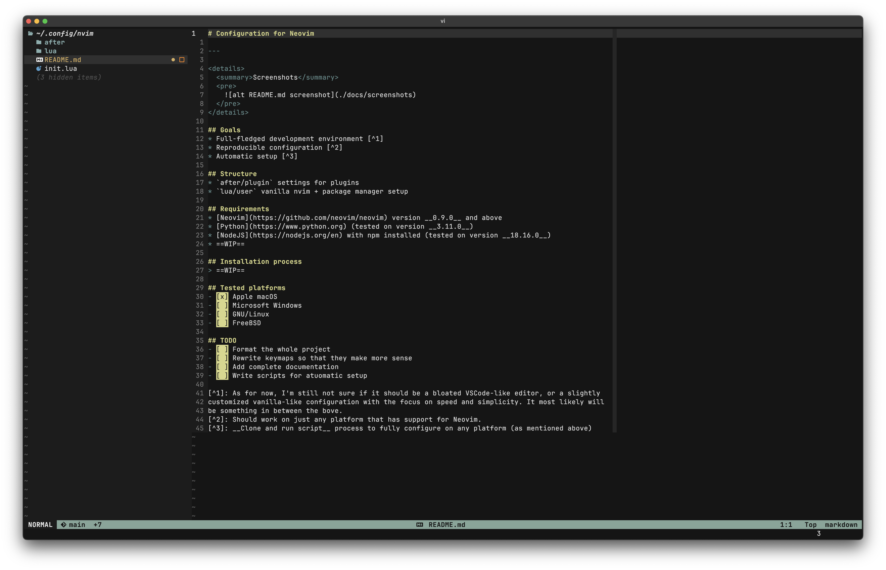

# Configuration for Neovim

---

  
Screenshots

  <pre>
    
  </pre>

## Goals
* Full-fledged development environment [^1]
* Reproducible configuration [^2]
* Automatic setup [^3]

## Structure
* `after/plugin` settings for plugins
* `lua/user` vanilla nvim + package manager setup

## Requirements
* [Neovim](https://github.com/neovim/neovim) version __0.9.0__ and above
* [Python](https://www.python.org) (tested on version __3.11.0__)
* [NodeJS](https://nodejs.org/en) with npm installed (tested on version __18.16.0__)
* ==WIP==

## Installation process
> ==WIP==

## Tested platforms
- [x] Apple macOS
- [ ] Microsoft Windows
- [ ] GNU/Linux
- [ ] FreeBSD

## TODO
- [ ] Format the whole project
- [ ] Rewrite keymaps so that they make more sense
- [ ] Add complete documentation
- [ ] Write scripts for atuomatic setup

[^1]: As for now, I'm still not sure if it should be a bloated VSCode-like editor, or a slightly
customized vanilla-like configuration with the focus on speed and simplicity. It most likely will
be something in between the bove.
[^2]: Should work on just any platform that has support for Neovim.
[^3]: __Clone and run script__ process to fully configure on any platform (as mentioned above)
